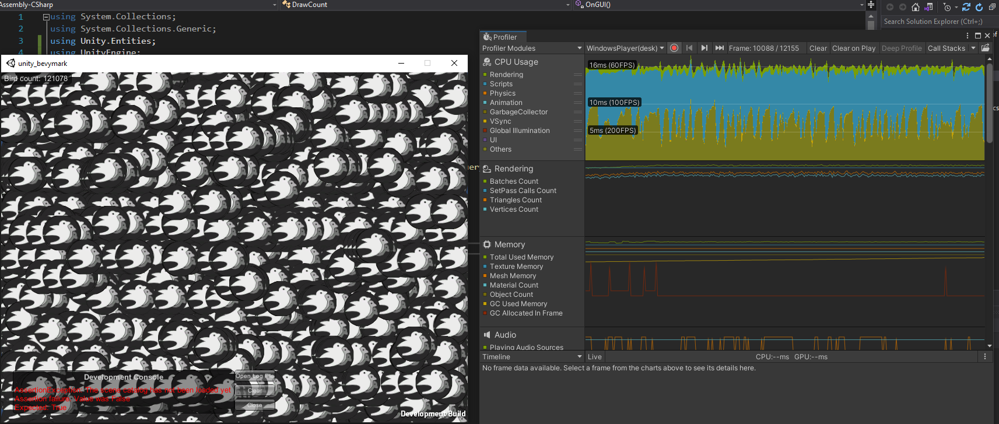

# unity_bevymark

Simple copy of the [bevymark benchmark](https://github.com/bevyengine/bevy/blob/main/examples/tools/bevymark.rs) 
made in Unity DOTS for comparison's sake. This was made with the most up to date versions of DOTS packages (0.17) as of 
this writing using Unity 2020.3.18f. It uses a plain quad with the urp-unlit material and the hybrid renderer for rendering.

